# 7-Deadly-Sins
*By Team **7-Deadly-Sins**\
(Boh Cheng Hin and Phoe Chuan Yi, Benny)*

For NUS Orbital (a.k.a., CP2106: Independent Software Development Project) Summer 2020\
Achievement Level: Artemis (Extreme)

## Table of contents
- [Game Download](#download)
- [Description](#description)
- [Motivations](#motivations)
- [User Stories](#user-stories)
- [Scope of project](#scope-of-project)
- [Features](#features)
- [Program Flow](#program-flow)
- [Features Explanation](#features-explanation)
- [Core Mechanics](#core-mechanics)
- [Development Process](#development-process)
- [Music References](#music-references)

## Download
### Windows 
https://drive.google.com/file/d/1bMkPjoNPPCea7h53itgsma0F_KXCKY1U/view?usp=sharing

### Mac
https://drive.google.com/file/d/1SjNkNMJ9jDrhR0Aklv9WJC0mGoaL-TQr/view?usp=sharing

## Description
It’s the Action-packed RPG where you fight and defeat the 7 deadly sins in order to break free and emerge stronger! The evil sins are Pride, Greed, Gluttony, Lust, Wrath, Sloth and Envy. Hack and Slash your way through a total of 7 scenes, with each scene having their own unique gameplay. Punch, Slash and Shoot to clear waves of enemies, sustaining your life with potions, dodging projectiles, and upgradable armor. Challenging but addictive gameplay will leave you wanting more!

## Motivations
A game that revolves around the sins of real life. Humans like us are prone to giving in to temptations and face the evils that continue to make our lives miserable and unhappy. Ever felt that there is a lack of motivation to face such evils yourselves? Or might these sins be pulling you down, limiting yourselves from unleashing your true potential? 

## User Stories
Scenario 1: A gamer who suddenly finds himself curious as to what the 7 deadly sins are. He could be wondering, if he had already committed those sins and wants to dive deep into an educational yet exciting experience.

Scenario 2: Someone who picks up the game, and manages to find solutions to his own problems in the game by reflecting on the actions of the character in the game. 

Scenario 3: A person who wants to relieve his stress by fighting his way through hordes of enemies in this virtual setting. Someone who loves Action/Adventure type RPG.

## Scope of project
A RPG (Role-Playing Game) where the player gets to immerse himself into a character who is experiencing multiple desires in his life. At the brink of exhaustion and in a bid of desperation, he finds himself given a chance to redeem himself and overcome these vices.

## Features 

* Camera Control
* Player movement and interactions
* Character Combat and Statistics
* Enemies and Bosses
* Diverse and Upgradable Skills
* Variety of equipment, potions and other items
* Shop System
* HotKey System
* Particle Systems/ Game effects
* Background Music and sound effects
* User friendly UI systems
* Dialogue Systems
* Unique gameplay for 7 scenes
* Scene explanations after each scene completion
* Transferring data between scenes
 

## Program Flow
**Opening Scene/Game Introduction** - A short sorrowful background story about the main protagonist, Leonard. You play as Leonard to redeem yourself. A start menu along with an options menu is made.

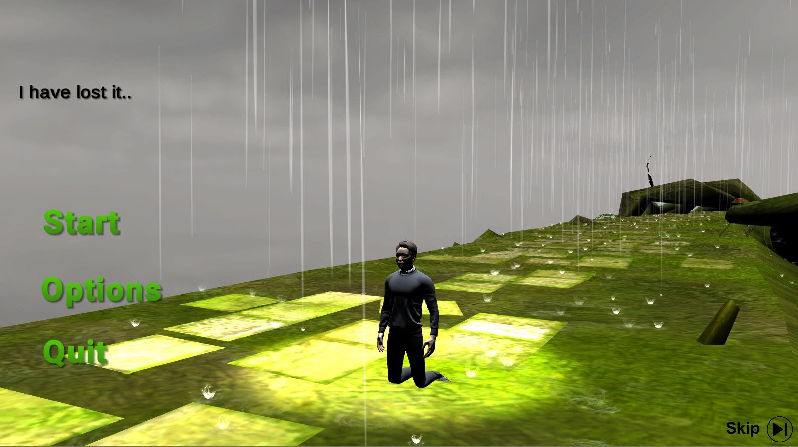
 

**Tutorial** - Brief tutorial to go through the basics movement and controls of the game. Without this, you will definitely not survive. 

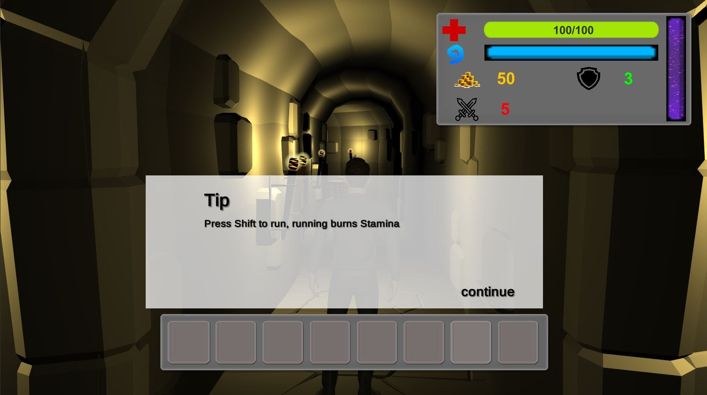

**Shop Scene** - A plethora of equipment, potions and weapons. Spend wisely!

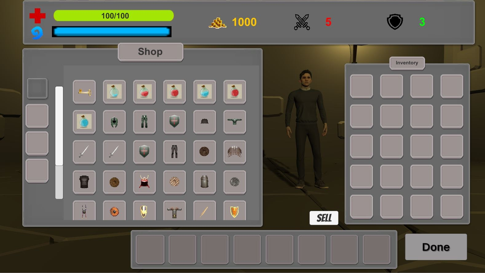

**Sloth - Platforming Stage** - The first stage is a test of patience and platforming skills and allows you to get used to the controls. Explore all areas, you will be faced with multiple traps but rewarded handsomely with good chest loots hidden in the area!

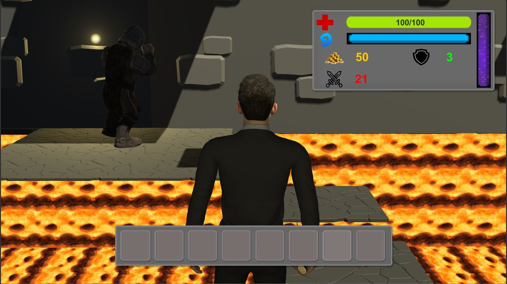
 

**Gluttony - Waves Stage** - One word - Survive. Use all means possible, fight through multiple waves and defeat the boss. Be expected to try this a few times and discover various techniques and methods to win.

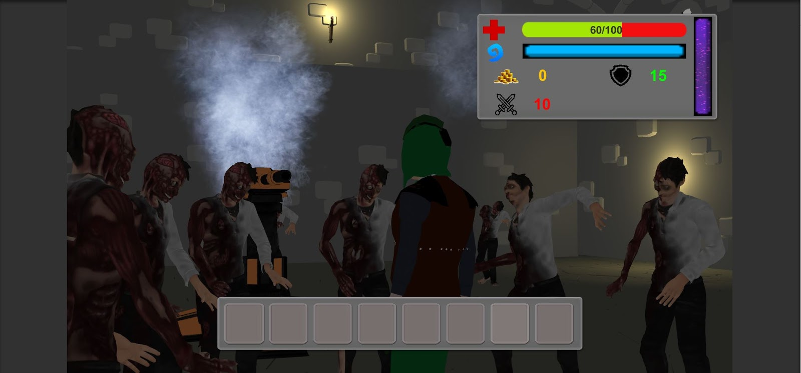
 

**Lust - Puzzle Stage** - Time for a tiny break after the previous overload of killing with a puzzle/search scene. Search for clues to solve the puzzle! Hint : Sometimes you have to kill to get what you want. Ready for a test of intellectual ability?!

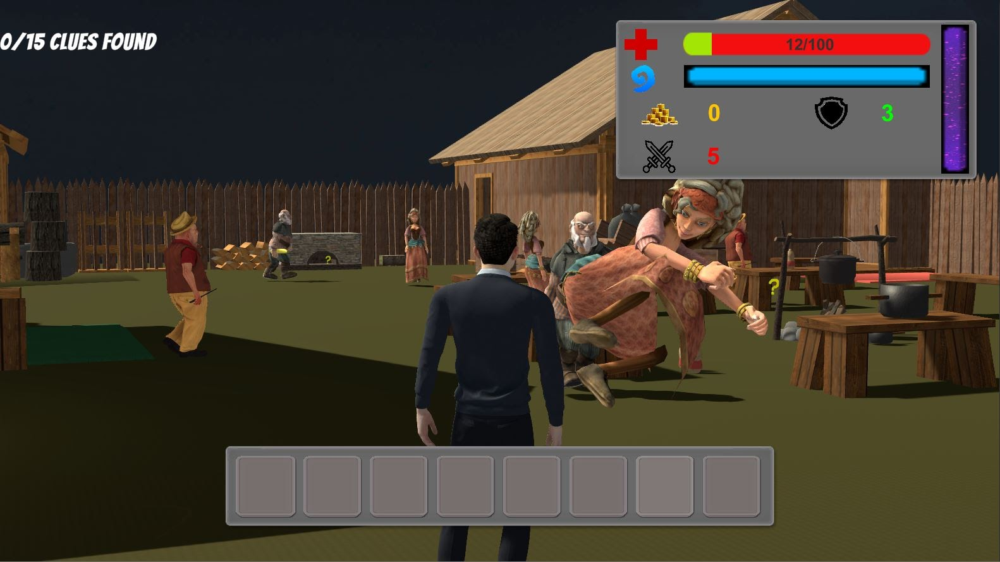
 

Envy - NPC Scene - What’s a RPG without some NPCs ordering you around? In this scene, do multiple quests to satisfy the gatekeeper. What a demanding NPC..

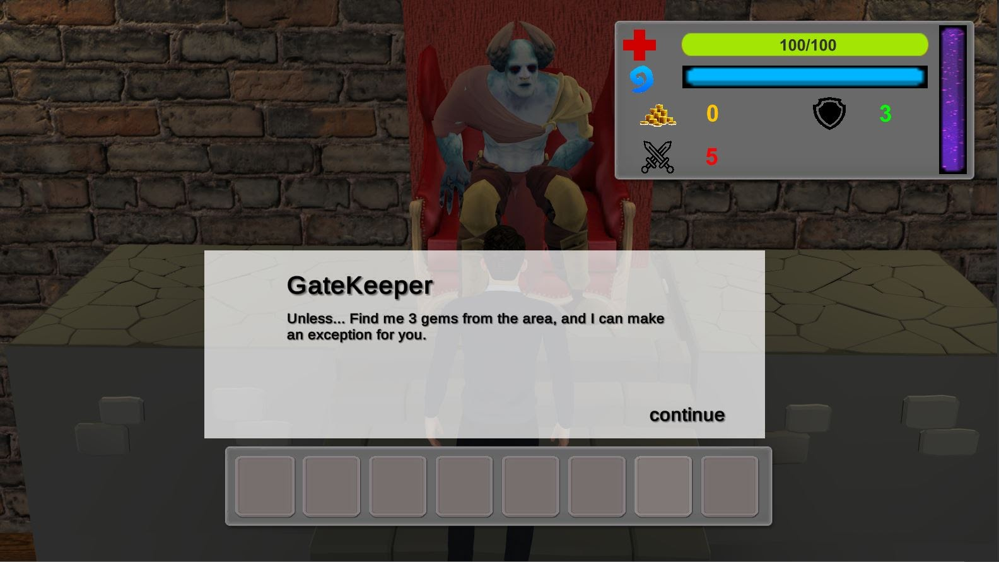
 

**Greed - Hack And Slash Scene** - Go crazy in this scene and fight through 3 levels of pure pain and gore. What’s a fight without the help of some companions fighting alongside you, and get ready for some charring action. 

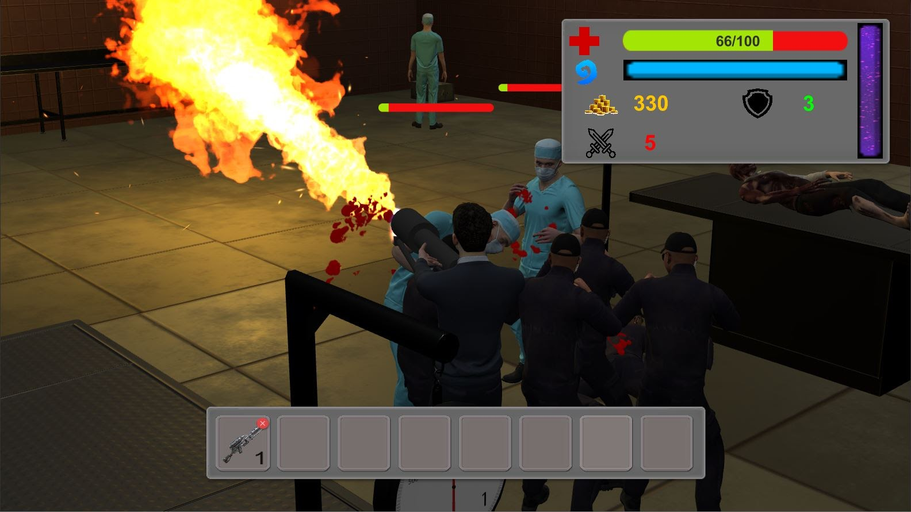
 

**Pride - Waves 2 Scene** - This is where all skills, techniques and hidden tricks up your sleeves are used. Just remember, Dodge, Sprint and Jump is the way to evade!

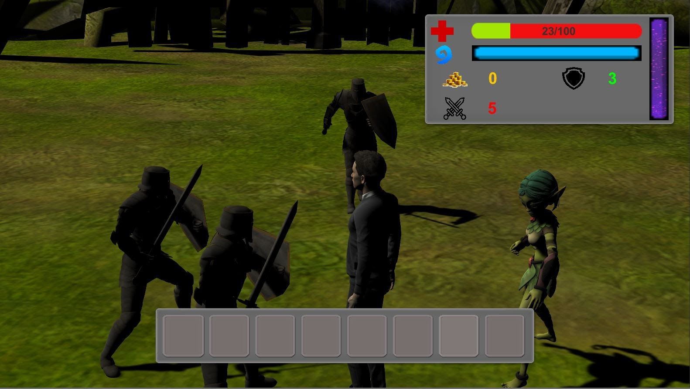
 

**Wrath - Final Boss Scene** - The final fight, do you have what it takes to redeem yourself? Or is it too late.. Give it your all!

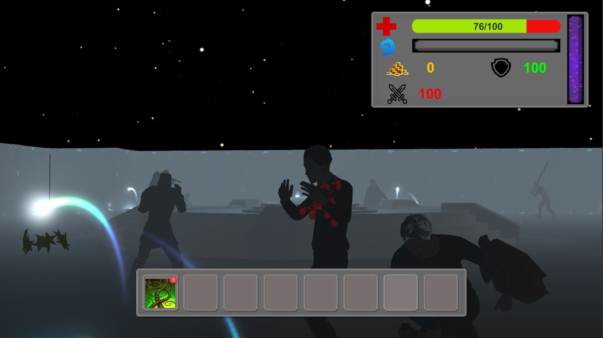
 

**After Scene Completion Scene** - After completing each scene, a short description will be provided regarding the sin, and how you can overcome the sin. This is the least you can take away from this game.

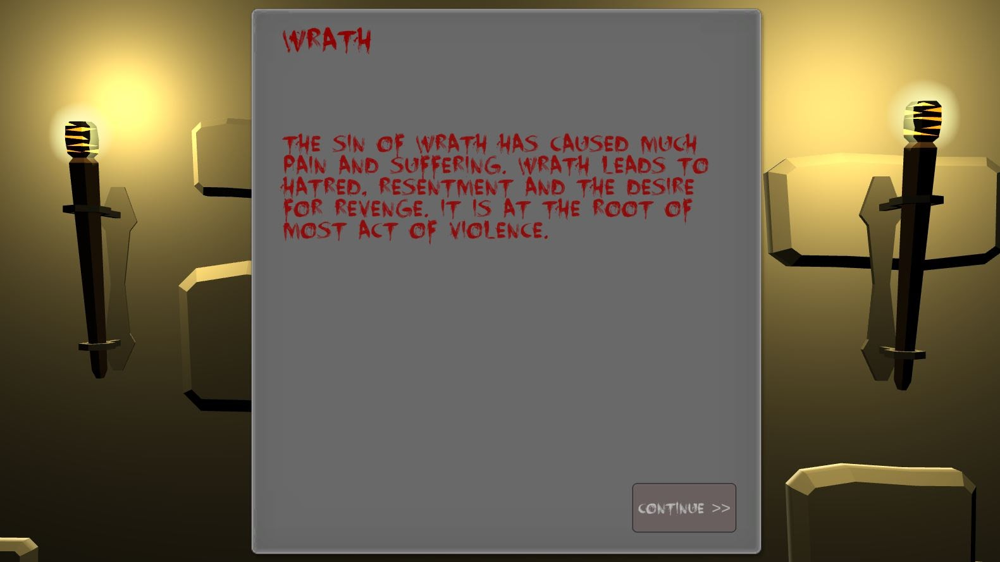
 

## Features Explanation

### Camera Controller

With most RPGs, the main camera being used is a third person Camera which allows the player to control vision using the mouse.
The Camera is able to detect collision around the player and adjust its position based on the obstacle position so that the gameplay view will not be obstructed. 
The Camera is extremely important as it is the main tool used for detecting any form of interactables. 
Many components of the gameplay relies on camera position as a ray that shoots out of the main camera is used.

### Player Movement and Interaction

Player movement is done with the all familiar WASD. Along with Space for jumping and R for rolling for a more versatile gameplay. There is also Climbing when going up ladders.

Player interaction with its surroundings is done with the mouse, both left mouse and right mouse click are utilised in gameplay. Player turning is also optimised for smoother rotation so that gameplay is less jittery.

A character Controller is used instead of a RigidBody for better control of movement and functionality but at the expense of physics on the body, but this is compensated with writing additional code. 

### Character Combat and Character Statistics
Combat plays an important role in an Action RPG game. We tried to make it similar to other games in similar Genre for eg. Dark Souls. Animations are used to make combat more exciting. We made combat more interesting with the addition of multiple weapons, and even a turret. 
With combat, there is definitely Statistics. We have damage, health, armor and speed stats for the player.

### Enemies and Bosses
A large number of enemies are used. Enemies are similar to a player just that the controls can be predetermined through code. 
Bosses are implemented to increase difficulty on the stage, bosses have a level-up ability whereby upon reaching a certain health, the boss is “enraged” and becomes more powerful in their own special ways.

### Diverse and upgradable skills: 
5 different skills, each with their own unique ability and stats. After completion of each level, the player is rewarded with a skill point to upgrade the skill in the skill tree. Skills are used to assist the player especially in times of emergency.
Skill 1: Fury - Damage Boost for a short period of time\
Skill 2: Smash Down - the next basic attack will be a stronger attack.\
Skill 3: Armor Boost - Increase armor but at the same time reduce movement speed.\
Skill 4: Ranged Spell - cast a ranged spell with acts like a homing missile towards the enemy.\
Skill 5 : AOE (Area of effect) - Stun nearby enemies and enemies take damage too.

### Variety of equipment, potions and other items:
A whole database of up to 40 items are included in the game. Equipment which includes armor and weapons, health and mana potions and other items such as keys and torches are available. 
Items can be bought/picked up as the game progresses. Equipment scales along with level so that players do not become too overpowered/underpowered.
Equipment is also Upgradable, increasing the depth of the game.

### Shop System
A gold system is implemented, where gold is dropped by enemies or found in chests. A user-friendly shop is made to make buying and selling items easy.
Items can be equipped/unequipped and potions can be drank in the shop to prepare the player for the next stage.
Shop is separated into multiple sections for easier purchase.

### HotKey System
With the use of Hotkey, players are able to access and use items and skills conveniently. Items and skills can be dragged from the inventory and skill tree respectively into the hotkey for usage.
123456ty keys are used as it is accessible to the player's hand. 

### Particle System/Game effects
Effects are the things that make gameplay more interactive and engaging. Simple effects such as blood effects, spell effects and even potions drinking effects can have an impact on the game. 

### Background Music/Sound Effects
We tried to find BGMs that are able to set the mood of each scene and environment. At the same time, providing some great entertainment in the process. 
Sound effects are also an indicator as to whether certain actions are completed properly.

### User friendly UI 
There are many types of UI implemented in this game. For example Shop UI, pause menu UI, Options Menu UI, Inventory UI, Chest Inventory UI, Equipment UI, Skill Tree UI.
We try to make it as user-friendly as possible so that using these UIs are of the least of concern for new players.

### Dialogue Systems
A simple dialogue system allows the narrator to tell the player instructions and introduces the game to the player. 
Dialogue is also used for allowing interaction between the character and the person playing. Thoughts of the character can be displayed to the player for better immersion experience.

Unique gameplay for all 7 scenes
With the main foundations set in place, we tried to make each level different from each other by utilising different gameplay elements.
Stage1 : Platformer type 
Stage2: Incoming Waves/Survival 
Stage3: Puzzle/Search 
Stage4: NPC/Quest
Stage5: Hack and Slash/Hardcore
Stage6: Incoming Waves/Survival
Stage7: Final Boss/Objective driven 

### Scene explanations after each scene completion
In order to tie in a form of educational purpose into the game, we felt that it is necessary to explain some ways you can actually overcome the sin in real life. 
We did not want this game to be pure evil/pure entertainment but provide some form of value to the person playing the game.

### Data transfer between scenes
Stores necessary data in a gameObject that will not be destroyed between scenes. Labelled as the Game Manager. Data it will store are: items in inventory, current equipment, what items were put in hotkeys, levels of the skills, etc.
GameObjects such as the player’s UI, and skill objects, etc, in new scenes will extract necessary data from the game manager, and set themselves up, before the new scene starts. This way transitions will be more seamless, as the data is accurately brought over to every scene.

## Core Mechanics

Movement and camera control: This is done with the regular WASD and mouse. The game is in third person view.

Interaction: The player can interact with objects such as chests, items and NPCs with left mouse click.

Attacking: Attack enemies with the button E. 

## Development Process
We used Unity game engine to build the game.\
Equipment models were modelled using Blender, a 3d modelling tool.\
Characters and animations were downloaded from Mixamo.\
We used Github and sourcetree as our git platform.\
We used Photoshop to make effects.

## Music References
forgottenland by airtone (c) copyright 2020 Licensed under a Creative Commons Attribution Noncommercial  (3.0) license. http://dig.ccmixter.org/files/airtone/61959 
Feeling Dark (Behind The Mask) by 7OOP3D (c) copyright 2010 Licensed under a Creative Commons Attribution Noncommercial  (3.0) license. http://dig.ccmixter.org/files/7OOP3D/29126 Ft: Artexflow

Doxent Zsigmond - Forest Dreams - Stjørdal Winter Mix by Fex (c) copyright 2020 Licensed under a Creative Commons Attribution (3.0) license. http://dig.ccmixter.org/files/Fex/

Late Night Smoke by Robbero (c) copyright 2020 Licensed under a Creative Commons Attribution Noncommercial license. http://dig.ccmixter.org/files/Robbero/60880 
Arcane by Doxent Zsigmond (c) copyright 2014 Licensed under a Creative Commons Attribution Noncommercial  (3.0) license. http://dig.ccmixter.org/files/doxent/48283 Ft: Javolenus

Two Swords by _ghost (c) copyright 2010 Licensed under a Creative Commons Attribution (3.0) license. http://dig.ccmixter.org/files/_ghost/26146 Ft: rocavaco, redhair
www.bensound.com

Reverie (small theme) by _ghost (c) copyright 2010 Licensed under a Creative Commons Attribution (3.0) license. http://dig.ccmixter.org/files/_ghost/25389 Ft: Pitx
Ghosts in the wind by Abstract Audio (c) copyright 2010 Licensed under a Creative Commons Attribution (3.0) license. http://dig.ccmixter.org/files/Citizen_X0/29247 Ft: orang_redux_777

